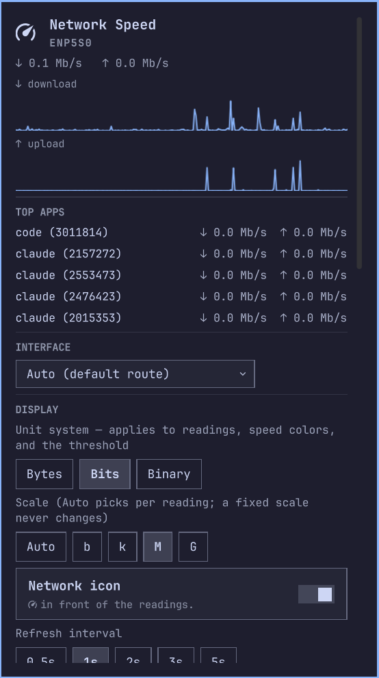

# Bandwidth

Live download and upload in the [Omarchy](https://omarchy.org/) bar. Pairs with the CPU and GPU widgets.




I built this for my own machine, alongside
[omarchy-cpu](https://github.com/DanSmith888/omarchy-cpu) and
[omarchy-gpu](https://github.com/DanSmith888/omarchy-gpu). The three share a
panel layout and controls.

## Install

```bash
omarchy plugin add https://github.com/DanSmith888/omarchy-bandwidth.git --enable
```

Update with `omarchy plugin update dansmith888.bandwidth && omarchy restart shell`.
Remove with `omarchy plugin remove dansmith888.bandwidth`.

## Using it

Left click opens the panel. Middle click opens `btop`. Hover for the interface
and full precision rates.

Bind a hotkey with `omarchy-shell shell toggle dansmith888.bandwidth`.

## The panel

| Section | Shows |
|---|---|
| Hero | Interface name and the live rates |
| Graphs | Download and upload history, 30 to 240 samples |
| Top apps | Per process bandwidth, busiest first |
| Interface | Auto (default route), all interfaces, or one NIC |
| Display | Unit system, fixed or auto scale, the pill icon, refresh rate |
| Download, Upload | The arrow glyph each direction uses |
| Idle threshold | Hide rates below a number and magnitude |
| Layout | A fixed reading width, or auto |
| Speed colors | A colour per magnitude band, from the active theme |
| Alert | Per direction limits that recolour a reading |

Settings live on the widget's `~/.config/omarchy/shell.json` entry and apply
immediately.

## Units

Three systems, and the choice drives the readings, the speed colours and the
thresholds together:

- decimal bytes: kB, MB, GB
- bits: kb, Mb, Gb
- binary bytes: KiB, MiB, GiB

Auto picks a magnitude per reading. A fixed scale never changes.

## Requirements

Omarchy (Quattro or later). `iproute2` for `ss`, which attributes traffic to
processes, and is on a stock Arch install. `btop` only for the middle click
shortcut.

## Notes

Rates are a delta between polls, read from `/proc/net/dev`.

Each reading reserves the width it has needed and never shrinks, so the bar does
not reflow as the numbers change. Pin a width under Layout if you prefer a fixed
column.

## What runs, and as whom

Omarchy plugins run inside the shell process, unsandboxed, as your user. This
one reads `/proc/net/dev` and `/proc/net/route`, and runs `ss` while the panel
is open. No shell is involved: each collector is executed directly by absolute
path with a scrubbed environment, a byte cap and a watchdog that kills it if it
hangs. No daemon, no root, no network of its own, and nothing written outside
its own folder.

## Related

I built this alongside two companions that share the same panel style:
[CPU](https://github.com/DanSmith888/omarchy-cpu) (load, per-core activity, temperature and clock) and
[GPU](https://github.com/DanSmith888/omarchy-gpu) (load, VRAM, temperature and power).
Each installs the same way and they sit well side by side in the bar.

## Credits

This began as a fork of
[omarchy-network-speed](https://github.com/csawy3r/omarchy-network-speed) by
Chris Sawyer, MIT licensed, and has been substantially rewritten since. His
copyright notice stays in [LICENSE](LICENSE) alongside mine, as MIT requires.

## Licence

MIT, see [LICENSE](LICENSE).
